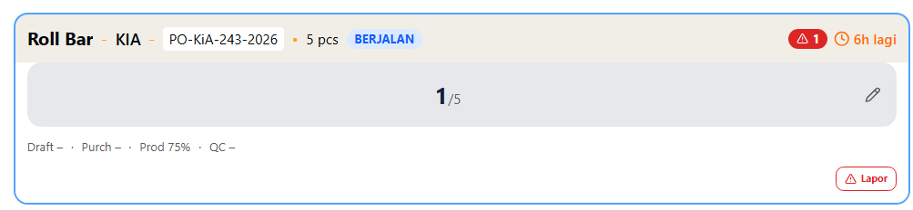

Project Management Document v2.0
System: LacakPO.id - Concurrent Multi-Department Progress Tracking
Deployment: Vercel | Auth: Username-Only | Design: Apple Minimalist + Multi-Theme

1. EXECUTIVE SUMMARY

LacakPO.id adalah sistem tracking manufaktur dengan pendekatan Concurrent Department Tracks. Setiap item dalam PO dapat dikerjakan oleh beberapa department (Drafting, Purchasing, Production, QC, Delivery) secara bersamaan dengan progress independen.

Key Differentiators
- No Workflow Lock: Semua department bisa update progress kapan saja, tidak ada urutan wajib
- Independent Progress: Drafting 30%, Purchasing 80%, Production 50% — semua valid secara bersamaan
- Auto-Audit Trail: Setiap perubahan terekam otomatis oleh sistem (siapa, kapan, dari berapa ke berapa)
- Smart Input: Slider + Quick Set (0/25/50/75/100) + Fine adjustment (-5%/+5%)
- Dual PO System: PO Internal (primary) + PO Client (optional reference)
- Multi-Theme System: 4 tema warna (Ocean Flame, Midnight Ember, Teal Gold Luxe, Warm Ivory)
- Real-Time Sync: Pusher-powered live updates dengan toast notifications
- Vendor Job Support: PO dapat ditandai sebagai pengerjaan vendor (Production tidak bisa update)

2. SYSTEM ARCHITECTURE

2.1 Concurrent Track Model

Item: Bearing SKF 6205
├── Track: Drafting     [████████░░] 80% (Budi)
├── Track: Purchasing   [██████████] 100% ✅ (Sari)
├── Track: Production   [█████░░░░░] 50% (Andi)
├── Track: QC           [░░░░░░░░░░] 0% (Dewi)
└── Track: Delivery     [░░░░░░░░░░] 0% (Waiting)

All tracks active simultaneously
No blocking between departments

2.2 Data Flow

User Input (Slider/Quick Set)
    ↓
Update Track Progress (item_tracks table)
    ↓
Auto-Generate Activity Log (activity_logs table)
    ↓
Trigger Pusher Event (real-time sync)
    ↓
All Connected Clients Update Instantly

2.3 Card Status Coloring
- Urgent (🔴 PO Penting): Border merah
- Delayed (Deadline lewat): Border merah + label
- Ongoing (Progress aktif): Border oranye
- Delivery Close (Siap kirim): Border hijau
- Completed (Terkirim + Lunas): Border hijau solid

3. DATABASE SCHEMA

3.1 Core Tables (Prisma Schema)

// USERS (Username-only auth dengan department)
model User {
  id            String   @id @default(uuid())
  username      String   @unique
  passwordHash  String
  name          String
  role          String   // super_admin, manager, sales_admin, drafter, purchasing, cnc_operator, milling_operator, fab_operator, qc, delivery, finance
  department    String
  isActive      Boolean  @default(true)
  createdAt     DateTime @default(now())
}

// CLIENTS
model Client {
  id             String   @id @default(uuid())
  code           String   @unique
  name           String
  contactPerson  String?
  phone          String?
  address        String?
}

// PURCHASE ORDERS (Dual Number System + Vendor Support)
model PurchaseOrder {
  id                String    @id @default(uuid())
  poNumber          String    @unique
  clientPoNumber    String?
  clientId          String
  poDate            DateTime
  deliveryDeadline  DateTime?
  notes             String?
  status            String    @default("active")
  isUrgent          Boolean   @default(false)
  isVendorJob       Boolean   @default(false)
  vendorName        String?
  vendorPhone       String?
  vendorEstimation  DateTime?
  isInvoiced        Boolean   @default(false)
  invoicedAt        DateTime?
  invoiceNumber     String?
  isPaid            Boolean   @default(false)
  paidAt            DateTime?
  finishedAt        DateTime?
  createdBy         String
  createdAt         DateTime  @default(now())
}

// ITEMS
model Item {
  id                String    @id @default(uuid())
  poId              String
  itemName          String
  specification     String?
  quantityTotal     Int
  quantityUnit      String    @default("pcs")
  quantityDelivered Int       @default(0)
  isDelivered       Boolean   @default(false)
  deliveredAt       DateTime?
  productionType    String    @default("both")
  createdAt         DateTime  @default(now())
}

// ITEM TRACKS (Concurrent Progress - CORE)
model ItemTrack {
  id          String    @id @default(uuid())
  itemId      String
  department  String    // drafting, purchasing, production, qc, delivery
  progress    Int       @default(0)
  updatedBy   String?
  updatedAt   DateTime?
  lastNote    String?
  
  @@unique([itemId, department])
}

// ACTIVITY LOGS (Auto-Generated Audit)
model ActivityLog {
  id             String   @id @default(uuid())
  itemId         String
  trackId        String?
  actorId        String
  actorName      String
  actorRole      String
  department     String
  actionType     String   @default("progress_update")
  oldProgress    Int?
  newProgress    Int?
  delta          Int?
  systemMessage  String
  userNote       String?
  createdAt      DateTime @default(now())
}

// ISSUES (Problem Tracking)
model Issue {
  id          String    @id @default(uuid())
  itemId      String
  title       String
  description String?
  priority    String    // high, medium, low
  status      String    @default("open")
  createdBy   String
  createdAt   DateTime  @default(now())
  resolvedAt  DateTime?
  resolvedBy  String?
}

// DELIVERIES
model Delivery {
  id               String   @id @default(uuid())
  itemId           String
  quantity         Int
  deliveryDate     DateTime
  suratJalanNumber String?
  notes            String?
  deliveredBy      String
  createdAt        DateTime @default(now())
}

3.2 Indexes
- idx_po_status, idx_po_deadline, idx_po_invoiced, idx_po_paid
- idx_items_po, idx_tracks_item, idx_tracks_dept
- idx_logs_item, idx_logs_created
- idx_issues_item, idx_issues_status

4. USER ROLES & PERMISSIONS

4.1 Role-Track Mapping

Role              Can Update Tracks    Can View All    Special Permissions
─────────────────────────────────────────────────────────────────────────────
Super Admin       All departments      ✅ Yes          Full access, user management
Manager           None (View only)     ✅ Yes          View reports
Sales Admin       None                 ✅ Yes          Create PO, edit own
Drafter           Drafting             ✅ Yes          Update drafting track
Purchasing        Purchasing           ✅ Yes          Update purchasing track
CNC Operator      Production           ✅ Yes          Update production track
Milling Operator  Production           ✅ Yes          Update production track
Fab Operator      Production           ✅ Yes          Update production track
QC                QC                   ✅ Yes          Update QC track
Delivery          Delivery             ✅ Yes          Mark delivered
Finance           None                 Delivered only  Mark invoiced/paid

4.2 Concurrent Update Rules
- Multiple operators (CNC, Milling, Fab) can update the same Production track
- Last write wins dengan timestamp
- Real-time sync via Pusher untuk semua connected clients

5. THEME SYSTEM

5.1 Available Themes
1. Ocean Flame (Default) - Blue-green + Orange accent
2. Midnight Ember - Prussian blue + Warm orange
3. Teal Gold Luxe - Pine teal + Metallic gold
4. Warm Ivory - Khaki beige + Tangerine

5.2 CSS Variables
Each theme provides: --background, --foreground, --primary, --accent,
--muted, --card, --border, --destructive, --success, etc.

6. UI SPECIFICATIONS

6.1 Smart Progress Input

6.2 Department Milestones
- Drafting: 0% Belum mulai → 25% Draft awal → 50% Gambar 2D/3D → 75% Review internal → 100% Gambar ACC client
- Purchasing: 0% Belum mulai → 25% RFQ ke supplier → 50% PO ke supplier → 75% Material OTW → 100% Material tiba di gudang
- Production: 0% Belum mulai → 25% Setup mesin → 50% Proses machining/fabrication → 75% Finishing → 100% Selesai produksi
- QC: 0% Belum mulai → 25% Inspeksi dimensi → 50% Inspeksi visual → 75% Testing → 100% Lolos QC, siap kirim
- Delivery: 0% Belum siap kirim → 25% Persiapan dokumen → 50% Packing → 75% Dalam pengiriman → 100% Terkirim ke client

7. API ENDPOINTS

7.1 Core Endpoints

POST   /api/tracks/[trackId]/update    - Update progress (auth required)
GET    /api/items                      - List items dengan filter
GET    /api/items/[itemId]             - Get item detail dengan tracks & logs
POST   /api/items/[itemId]/issues      - Report new issue
POST   /api/items/[itemId]/delivery    - Update delivery quantity

GET    /api/pos                        - List all POs
POST   /api/pos                        - Create new PO
GET    /api/pos/[id]                   - Get PO detail
PUT    /api/pos/[id]                   - Update PO
DELETE /api/pos/[id]                   - Delete PO
PUT    /api/pos/[id]/finance           - Update invoice/payment status

GET    /api/dashboard                  - Dashboard statistics
GET    /api/logs                       - Activity logs dengan filter
GET    /api/issues                     - List all issues
GET    /api/reports/dashboard          - Reports data (delayed, problems, finished, ongoing)
GET    /api/search?q=...               - Global search POs and items

7.2 Real-Time Events (Pusher)
- po-created: New PO created → inject items to all clients
- track-updated: Progress changed → update specific track bar
- issue-created: New issue reported → add issue badge
- issue-resolved: Issue resolved → update issue badge
- item-delivered: Item marked delivered → update delivery status
- po-status-changed: PO cancelled/archived → remove items
- po-urgent-changed: URGENT flag toggled → update urgency badge
- finance-updated: Invoice/payment updated → update finance status

8. DEVELOPMENT STATUS

✅ COMPLETED
[✅] Next.js 14 + Tailwind CSS + shadcn/ui setup
[✅] Prisma schema dengan SQLite/Turso support
[✅] Iron Session authentication (username + PIN 5 digit)
[✅] Multi-theme system dengan runtime switching
[✅] Dashboard dengan role-based redirects
[✅] Dual PO system (Internal + Client PO Number)
[✅] Smart Progress Input (Slider + Quick Set + Fine adjust)
[✅] Auto-log generation untuk setiap perubahan
[✅] Real-time sync dengan Pusher
[✅] Department-specific task views
[✅] Issue tracking system
[✅] Delivery management dengan surat jalan
[✅] Finance module (invoice & payment tracking)
[✅] Reports dashboard untuk managers
[✅] Search functionality
[✅] Skeleton loading screens
[✅] Responsive design untuk mobile
[✅] Vercel deployment ready

9. TECHNICAL REQUIREMENTS

Stack
- Framework: Next.js 14.2.21 (App Router)
- Language: TypeScript 5.x
- Database: SQLite (local) / Turso (production)
- ORM: Prisma 5.22.0
- Auth: Iron Session 8.0.4 (stateless)
- Styling: Tailwind CSS v4 + shadcn/ui
- State: Zustand 5.0.11
- Real-time: Pusher Channels + Pusher Beams
- Icons: Lucide React

Performance Targets
- First load: < 2s (4G)
- API response: < 100ms
- Real-time latency: < 200ms
- Build size: < 200KB (initial)

10. SUCCESS CRITERIA

[✅] User bisa update progress department masing-masing secara bersamaan tanpa blocking
[✅] Auto-log tergenerate setiap perubahan dengan detail lengkap (who, when, change)
[✅] Input progress menggunakan Smart Component (Quick Set + Slider + Fine adjust)
[✅] Dual PO number tersimpan dan ditampilkan dengan benar
[✅] Semua department punya visibility ke progress department lain (transparency)
[✅] Real-time updates via Pusher untuk semua connected users
[✅] Multi-theme system dengan 4 palette options
[✅] Vendor job support untuk external production
[✅] Reports dashboard untuk monitoring performance
[✅] Deployed ke Vercel dengan zero critical bugs

Document Version: 2.0
Last Updated: 2026-02-28
Status: Production Ready
Project: LacakPO.id
